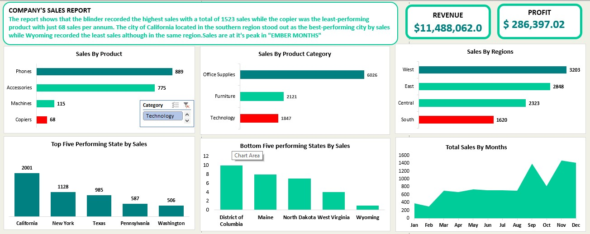
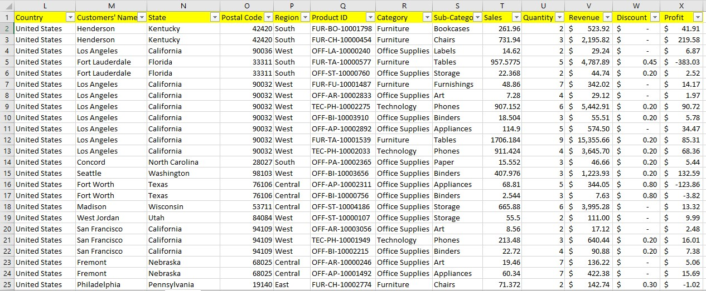
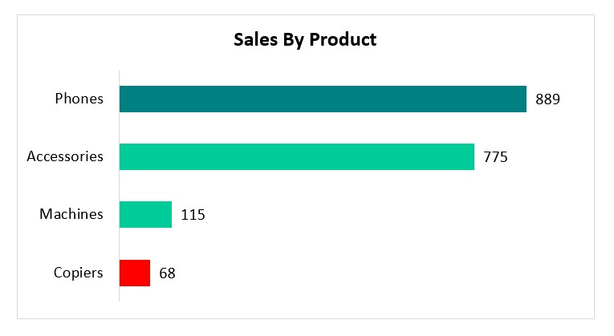
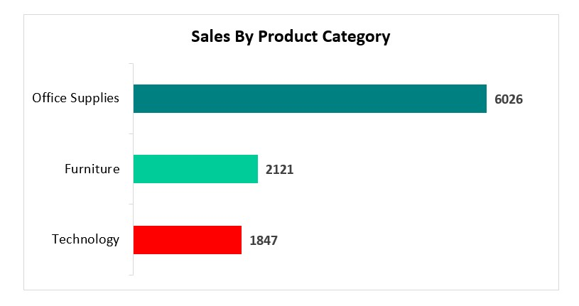
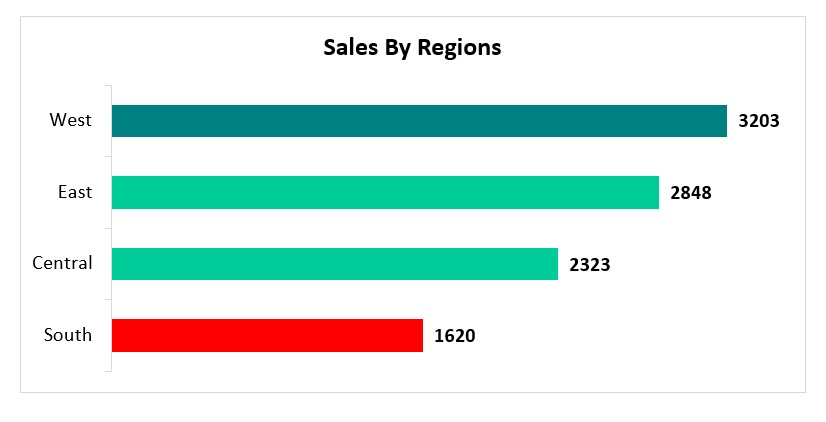
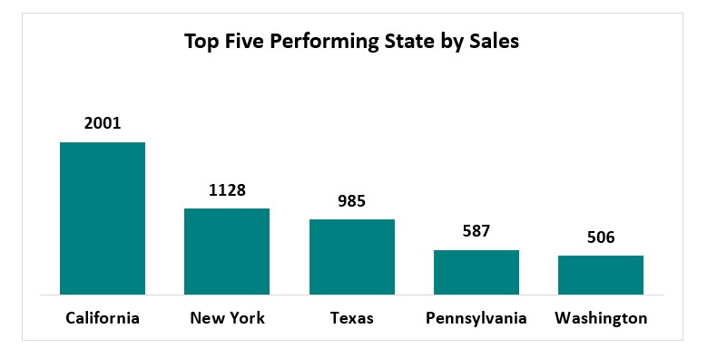
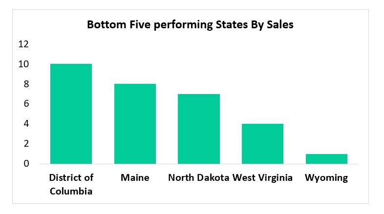

# "Strategic Sales Analysis and Performance Evaluation for Informed Decision-Making

# About the analysis
This analysis was carried out to evaluate based on the company’s performance in the previous year, which specific category, quarters, Months, Products, and states deserves more attention. This will serve as pointers to perform better and make informed decisions in the coming year.
# Questions I want to answer
To achieve the objective stated above, I raise the following question to serve as a guide:
1.	What are the top-performing products in terms of sales and profit? 
2.	Which category showed the highest sales growth in the previous year
3.	Are there any particular regions where sales showed a noticeable increase or decrease?
4.	Which cities or states have been consistently driving high sales figures? 
5.	 Are there any specific quarters in the previous year that had significant fluctuations in sales?
6.	Which months in the previous year had the highest sales, and what factors contributed to those successful months?
# Skills Involved
1. Data **Cleaning** 
2. Data **Manipulation**
3. Data **Filtration**
4. Use of **Pivot Table**
5. Use of **COUNT FUNCTION**
6. Use of **SUM FUNCTION**
# Raw Data

# Data Manipulation
 The calculation for some key indicative figures such as **Total Profit, Total Number of Sales, Total Revenue Generated in the year, Total discount Given, and Quantities Sold** was done.  
The **COUNT FUNCTION** was used to calculate the Total Number of Sales, while SUM FUNCTION was used to calculate Total Profit, Total Revenue Generated in the year, Total discount Given, and Quantities Sold.
# Data Analysis
This analysis aims to determine top-performing products in terms of sales and whether the company should focus on promoting these products more in the new business year. To achieve this objective, I plotted a **bar chart** of the various product against their total sales that year and inserted a **slicer** to indicate the products according to their categories. The chart showed that in the **Office Supply category**, **Blinder** recorded the **highest** of **1523** which is the most sold good across **all categories**. While **Supplies** were the least-performing product in the category. In the **Technology category**, the **phone** was the most sold good while the **copier** was the least of all the company's products. For the **Furniture category**, **Furnishing** was the most sold good while **Bookcases** was the least sold good. 

To determine what **category** showed the highest sales growth in the previous year. Again I used a **bar chart** to show the total sales in the year by category. **Office Supplies** had the highest sales in the year with a **total sales of 6026**. While the **Technology** category had the lowest sales of **1847** as indicated by the red color in the chart.

An analysis of whether there are any particular regions where sales showed a noticeable increase or decrease is illustrated in the **bar chart** below. It revealed that the **western region** of the United States with a total sales of **3203** stood out among others while the **Southern region** had the lowest sales at **1620**.

To show which **states** have been consistently driving high and low sales figures, I used a column chart. The chart showed that **California, New York, Texas, Pennsylvania, and Washington**. With a total sales of **2001**, **California** is the state where most of the company’s goods are sold. On the contrary, **Wyoming, Virginia, North Dakota, Maine, and the District of Columbia** were the least performing States with just a **sale recorded in  Wyoming**.
/
And to reveal the specific **quarter** in the previous year that had significant fluctuations in sales and in which **month(s)** in the previous year had the highest sales, I used an **area chart**. The chart revealed that there were fluctuations from **September to December**. Sales gradually slid down till their lowest in **October** before rising again in **Novembe**r. However, this quarter of the year also had the highest sales which was in **December**. While the least sales were in **February** which the first quarter of the years.
# Recommendation
The company should adopt the same marketing strategy for the sales of Blinders to Copiers to increase its sales.
Much attention should be on the Technology category as this section had the lowest sales despite the spike in the use of technological products in recent times.
 While the company should not lose its firm grip in the western part of the nation, efforts should be made to strengthen the company’s sales in the South.
A thorough investigation should be done so as find out the reasons for the company’s low sales in the five states identified.
More products should be made available in the last quarter of the year since it has been observed that sales are at their peak at this period of the year. And also, the sales manager should establish the reason(s) why there was a drastic drop in sales in October.

